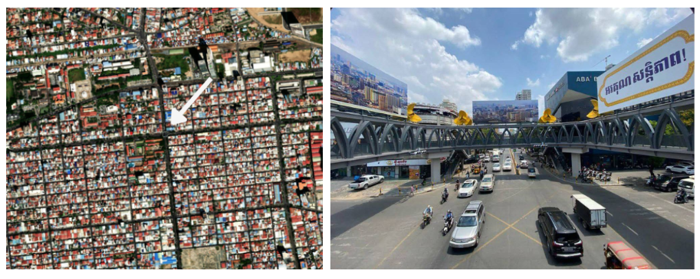
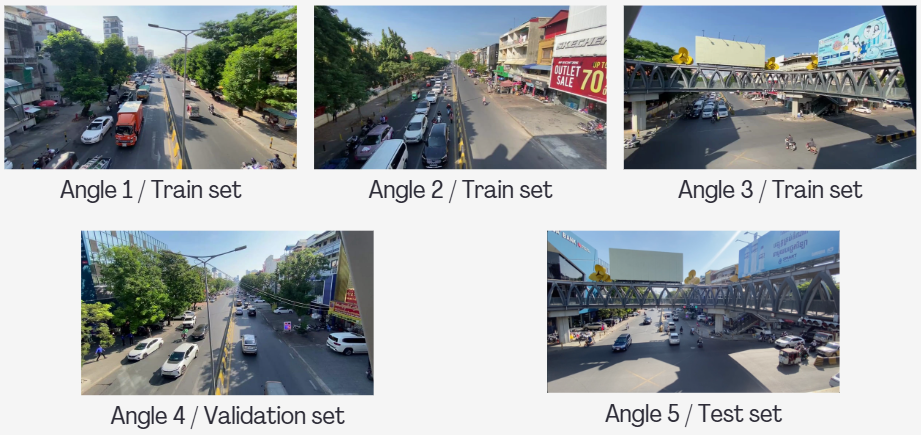

# Real-Time Vehicle Detection and Traffic Flow Counting System

This project presents a YOLOv8m-based model optimized for real-time vehicle detection in the Cambodian context. The system accurately detects and counts vehicles as they cross a predefined counting line in video footage, enabling for future traffic flow analysis and road monitoring.

## Overview
As Phnom Penh undergoes rapid urbanization, its transportation infrastructure faces increasing challenges from severe traffic congestion. Current traffic management systems rely heavily on static signal timers that do not adapt to real-time fluctuations in vehicle density. This results in inefficient traffic flow, long waiting times, wasted fuel, and reduced productivit. This project aims to address these issues by enabling real-time vehicle detection and counting using computer vision.

## Dataset
Due to the lack of publicly available datasets tailored to Cambodian traffic conditions, we constructed a custom dataset. Video data were collected at Santhor Mok Pedestrian Bridge, Phnom Penh, Cambodia, a busy road intersection.



Capture angles: 5 different camera angles
Time: Around 9:00 AM
Device: iPhone
Rexolution: 1920 × 1080
Frame rate: 30 FPS



The dataset is organized into different sets, each with corresponding label files.
**[Download Dataset on Kaggle](https://www.kaggle.com/datasets/sopheakchan/traffic-flow-dataset)**

## Training Process
The traffic object detection model was trained using YOLOv8m (medium variant) on the custom dataset. Training was conducted on Kaggle with GPU acceleration.

Configuration details:
Object classes (5): Bus, Car, Motorcycle, Rickshaw, Truck

Base model: YOLOv8m (pre-trained weights)
Epochs: 50
Batch size: 32
Image size: 640 × 640
Device: CUDA (GPU)
Data augmentation techniques:
Brightness adjustment: ±20%
Gaussian blur: up to 2.5 px
Noise: up to 0.5% of pixels

## Results & Conclusion
The model shows strong detection capabilities for Cars and Rickshaws, which are suitable for production use. 


However, performance varies across classes due to dataset imbalance, particularly for Buses and Trucks, which appeared less frequently during data collection.

## Demonstration in Ui
A web-based user interface is provided to demonstrate the full pipeline from video upload to vehicle counting and result export.

## What It Does

Users can upload a traffic video, define a detection area and a counting line on the first frame, and allow the system to process the entire video. The output includes:

A processed video with bounding boxes, tracking IDs, and counts
An Excel report containing detailed vehicle statistics
A full demonstration of the system is available on YouTube: https://youtu.be/gdLpEItEDIM

## Features

Interactive detection-area and counting-line selection via web UI
Real-time processing progress with frame counter
Detection and tracking of 5 vehicle classes
Exported video with visual overlays and statistics
Automatically generated Excel report with class-wise counts and percentages

## Project Structure

```
yolo_model_ui/
├── best.pt                    # Trained YOLOv8m model weights
├── train.ipynb                # Trained notebook (Kaggle)
├── requirements.txt           # Python dependencies
├── README.md                  # Project documentation
├── .gitignore                 # Git ignore rules
│
├── assets/                    # Documentation images/videos
│   ├── location.png
│   ├── angles-set.png
│   └── tested-video.mp4
│
├── ui/                        # Flask web application
│   ├── flask_app.py           # Main backend server
│   ├── templates/
│   │   └── index.html         # Frontend interface
│   ├── uploads/               # User uploaded videos
│   └── outputs/               # Processed videos & Excel reports
│
├── env/                       # Virtual environment 
│
├── inference-set/             # Test videos/images
└── uploads/                   # Backup video storage
```

## Setup

###  Create and activate virtual environment

```bash
python -m venv env
env\Scripts\activate  # Windows
source env/bin/activate  # macOS/Linux
```

###  Install dependencies

```bash
pip install -r requirements.txt
```

###  Make sure you have the model file

Place "trained" YOLO model as `best.pt` in the project root directory.

###  Run the application

```bash
cd ui
python flask_app.py
```

The app will start at `http://localhost:5000`

## How to Use

1. Upload your traffic video (MP4, AVI, MOV)
2. Click 4 points to define the detection area
3. Click 2 points to define the counting line
4. Start processing and wait for completion
5. Download the processed video and Excel report


## Notes
Processing time depends on video length and resolution. The system processes each frame for accurate tracking, so longer videos will take more time. Progress is shown in real-time with percentage and frame counts.

